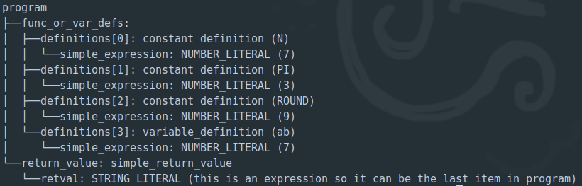
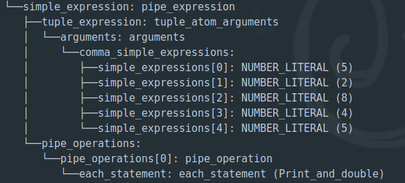
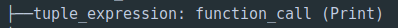

# Phase 03: Syntax Tree
## 1. What is an (abstract) syntax tree and how is it related to other parts in compilation?
In the compiling process of a typical programming language, syntax tree comes after the syntax analyzer. 
First, the lexical analyzer takes the code written in the programming language and creates a set of
tokens that contains the values and types of the strings. Then, the syntax analyser will then use the 
grammar rules specified to analyze the tokens from the lexical analyzer and create a syntax tree, which
imposes a hierarchical structure of the tokens.

-------------------------------------------
## 2. How is the syntax tree generated using the PLY tool? I.e., what things are needed in the code and how are they related to syntactic rules of the language and the tree?
In the project, we implement the syntax tree using python objects and yacc tool. More particularly, each grammar
rule is defined in a function that accepts a single argument ```p```. We then make up the semantic actions of 
the grammar rules by manipulating the values of ```p[i]```. We make a node in the syntax tree by making ```p[0]``` 
an object, e.g. ```p[0] = ASTnode('program')```, each node has a value and one or more child nodes. 

-------------------------------------------
## 3. Explain in English what kind of tree is formed in your code from the following syntactic elements:
### Variable definitions
Variable definitions take different forms in the code, it can be a constant definition, 
or a tuple variable definition. For example, with variable definition as a constant definition, the program creates a node with the name "constant definition",
the value of the node is the ```constIDENT``` which is the name of the constant, it has a child named 
```simple_expression```, which then will be reduced into a term, then a factor, and finally an atom.
.  
The picture above shows an example of a program that has 4 constant definitions, 
each one has a value in the brackets, e.g. N, PI, ROUND, and a child node of ```simple_expression``` which
is finally reduced to be a an atom of NUMBER_LITERAL type. 
### Pipe expressions
The below figure shows how a pipe expressions tree is formed: it has 2 child - tuple_expression and pipe_operations

### Function call (if you implemented it)
A function call is implemented as a node with value of the function name. It does not have any child.


-------------------------------------------
## 4. Answer the following based on the syntax definition and your implementation:
### In which cases is it possible in your implementation to end up with a tree with empty child attributes (somewhere in the tree there is a place for a child node (or nodes), but there is none)? I.e., in which situations you end up with tree nodes with child_... attribute being None, or children_... attribute being an empty list?
In the node below
```python
def p_zero_or_more_pipe_pipe_op(p):
    '''zero_or_more_pipe_pipe_op : PIPE pipe_operation'''
    p[0] = ASTnode('')
    p[0].children_pipe_operations = [p[2]]
```
which collects the pipe operations, its children can be an empty list. 
### Are there places in your implementation where you were able to "simplify" the tree by omitting trivial/non-useful nodes or by collecting a recursive repeating structure into a list of child nodes?
Like the example above, I was able to simplify the tree by implementing a node without a name that represents
the "zero_or_more" rule in the grammar. This node will collect all of the child nodes in its ```children_```
list, in this example it collects all the pipe_operations. 

------------------------------------------
## 5. Please mention in the document if you didn't implement functions (i.e. you are ok with passing with the minimum grade).

------------------------------------------
## 6. What did you think of this assignment? What was difficult? What was easy? Did you learn anything useful?
This assignment is quite hard and time consuming, partly because at first there was no output example.
However, the assignment helps me to understand more about the grammar rules, being able to visualize 
them in a tree structure makes understanding clearer and more satisfying.