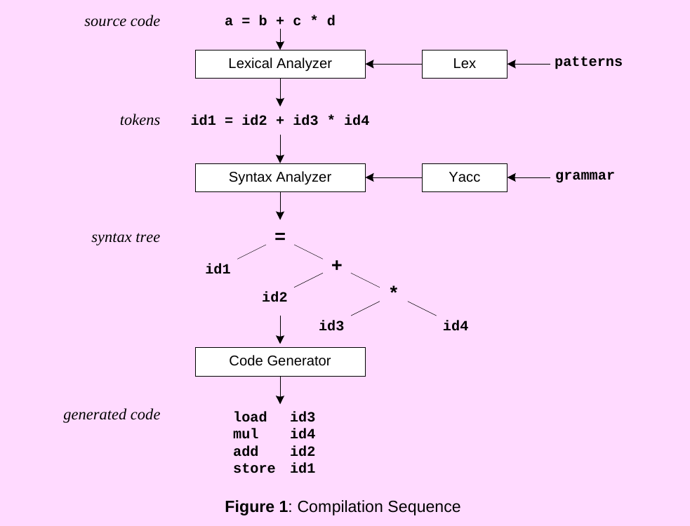

# TupLang

This is the code repository for the course TIE-20306 - Principles of Programming Languages at Tampere University, 2019.
There are 4 phases of the project, each one is a part of building a simple programming language called TupLang.  

Please only use for reference. 

